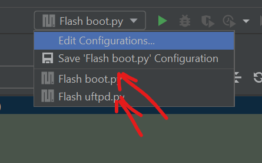
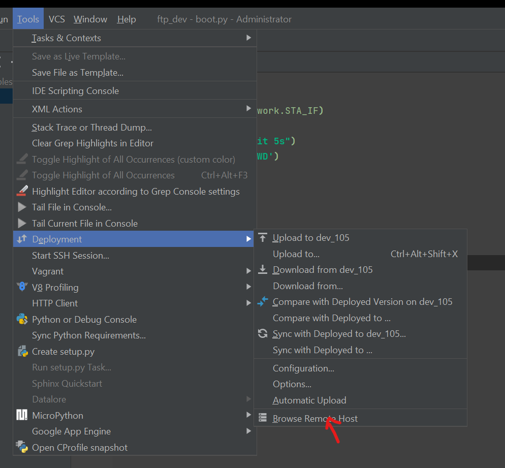
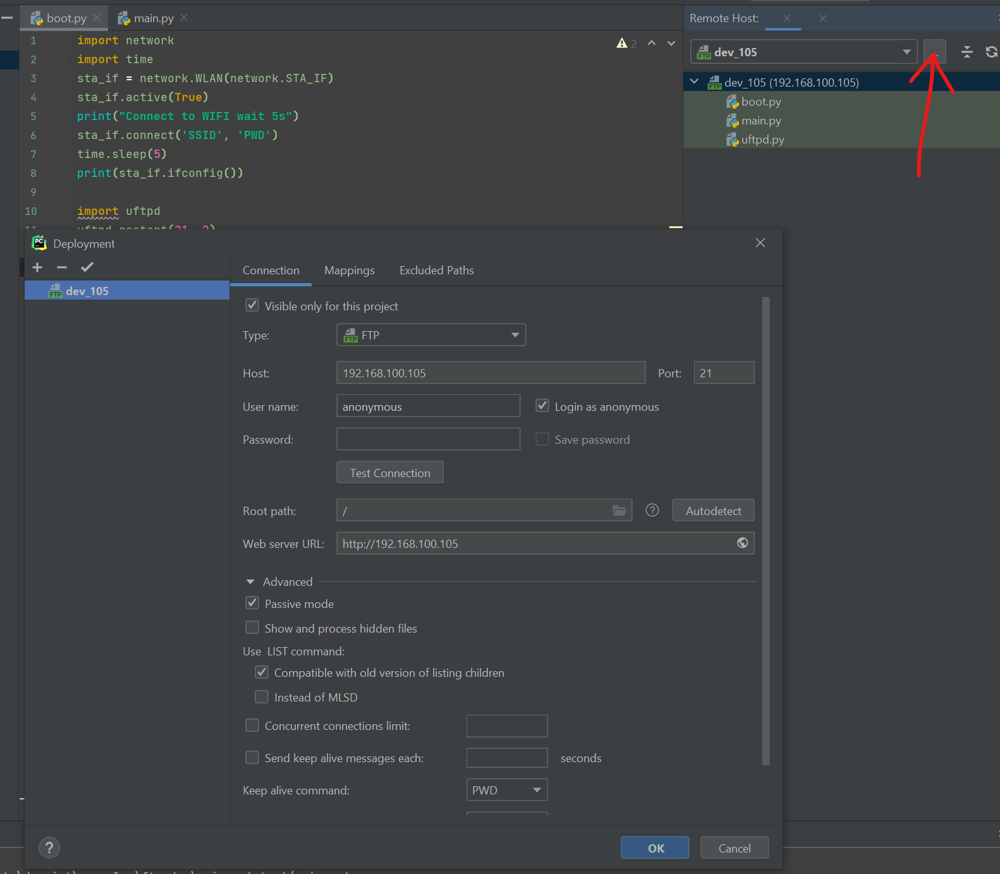
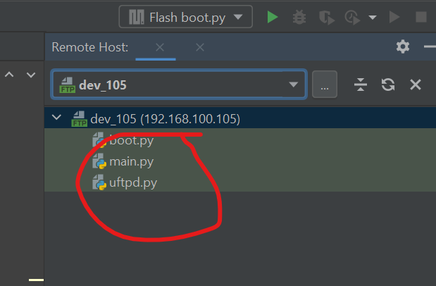
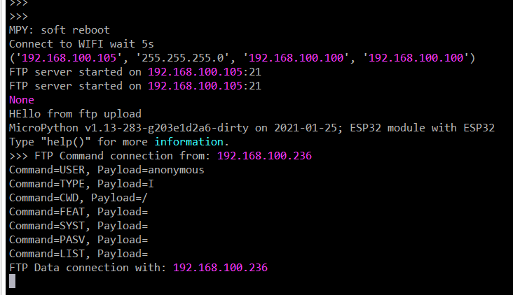
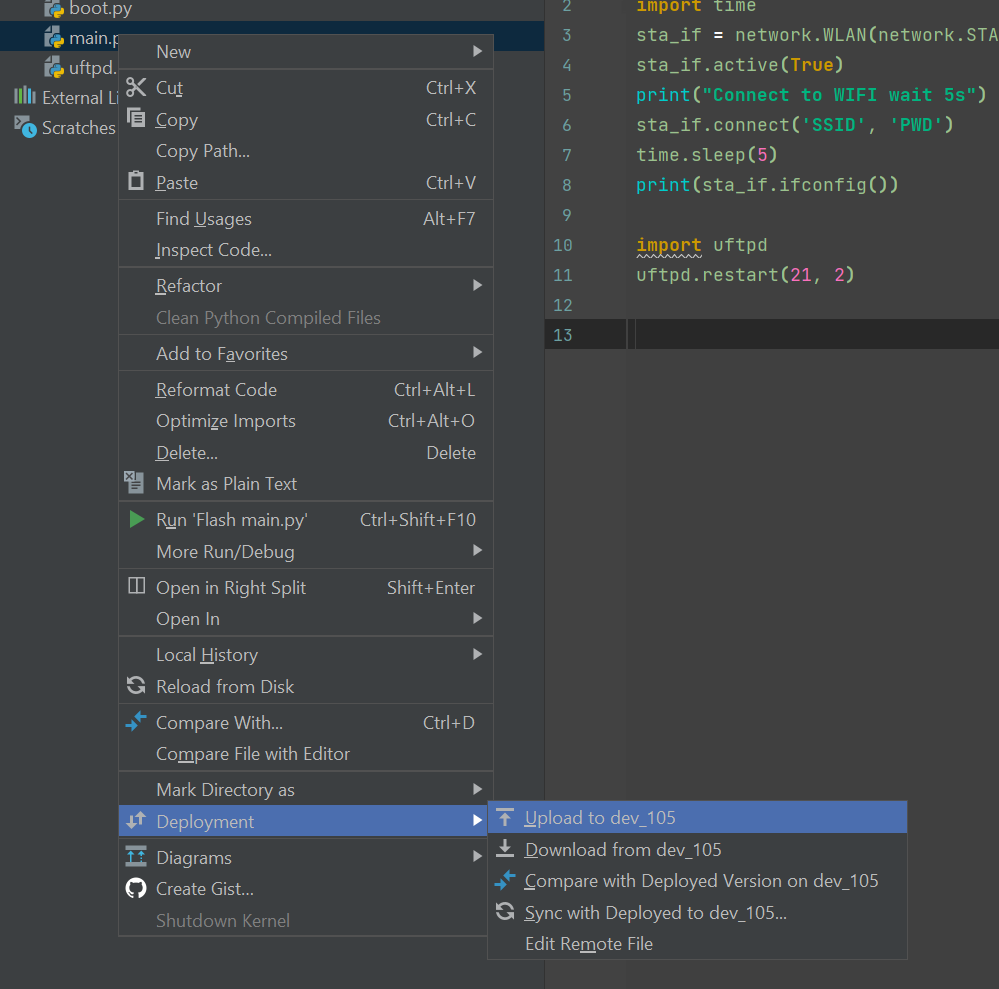
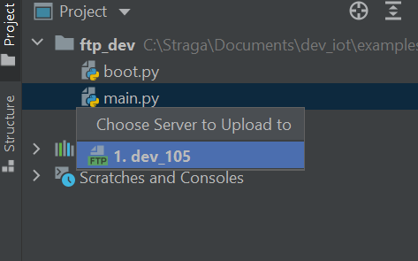

FTP DEV

FTP DEV

1. Open Pycharm Project.

2. boot.py - change ssid and password

3. Flash boot.py and uftpd.py

3. Configure Remote Host

Host: set yours' IP
Check - Tab: Mappings

4. Check connect to FTP and files exist.

5. connect to UART repl :putty/mobaxterm/pycharm-terminal

7. Mouse select main.py and upload 
 
 
 or select main.py and CTR+SHIFT+ALT+X send to poard
 
 
8. CTR+D repl terminal. Done