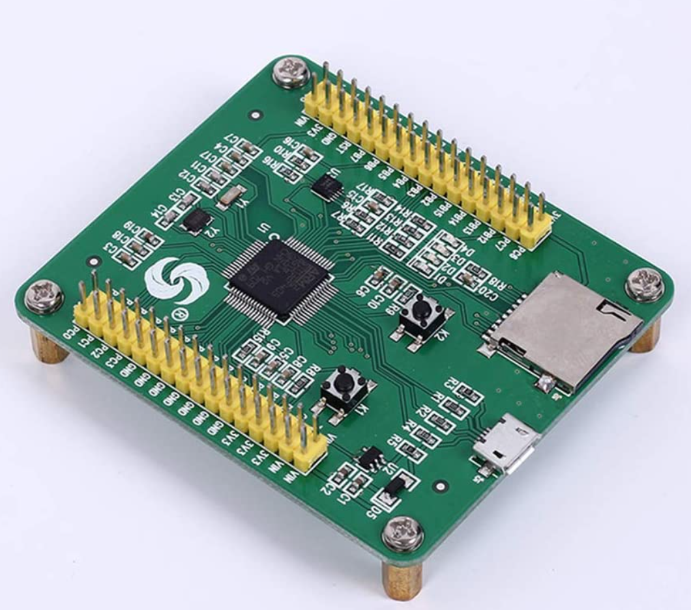
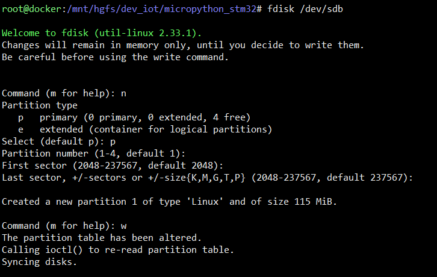
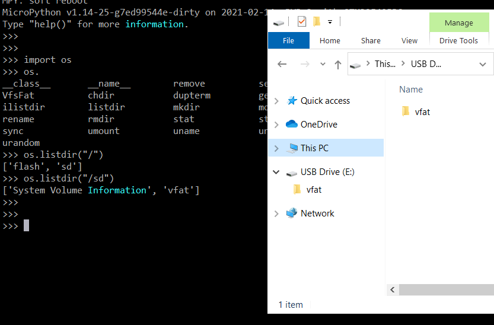

SDCARD STM32 pyboard v3 clone

SD card  128MB
1. Make portion: for example fdisk (Linux)

3. git clone repo micropython and install toolchain for STM32 (Linux)

4. Copy: micropython/ports/stm32/boards/PYBV3 to micropython/ports/stm32/boards/PYBV3_green
5. Change: micropython/ports/stm32/boards/PYBV3_green/mpconfigboard.h
FROM
// SD card detect switch
`#define MICROPY_HW_SDCARD_DETECT_PIN        (pin_C13)`
`#define MICROPY_HW_SDCARD_DETECT_PULL       (GPIO_PULLDOWN)`
`#define MICROPY_HW_SDCARD_DETECT_PRESENT    (GPIO_PIN_SET)`
TO
// SD card detect switch
`#define MICROPY_HW_SDCARD_DETECT_PIN        (pin_C13)`
`#define MICROPY_HW_SDCARD_DETECT_PULL       (GPIO_PULLUP)`
`#define MICROPY_HW_SDCARD_DETECT_PRESENT    (GPIO_PIN_RESET)`
6.  make BOARD=PYBV3_green
7. Flash dfu
8. Insert SD in STM32 and connect USB. Now usb drive it is SDCARD on stm32

